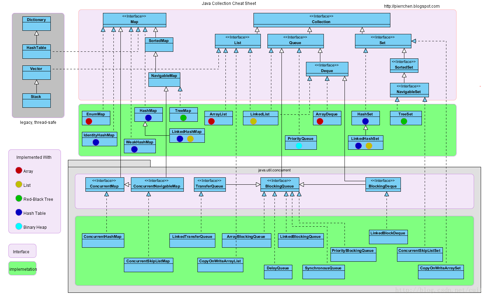

# 算法与数据基础

**参考书籍**：

 - [《算法》第4版中文版](https://item.jd.com/11098789.html)，[英文版官网讲解链接](http://algs4.cs.princeton.edu/home/)，Java语言描述
 - [《算法导论》中文版](https://item.jd.com/11144230.html)，英文名《Introduction to Algorithms, third edition》，伪代码描述

**基础数据结构**：

 - 数组
 - [位运算](http://blog.csdn.net/cuit/article/details/78665808)
 - [栈](http://blog.csdn.net/cuit/article/details/78389400)
 - 队列
 - [链表](http://blog.csdn.net/cuit/article/details/78374569)
 - [堆 (优先队列 Priority Queue)](http://blog.csdn.net/cuit/article/details/78410039)，[Java源码链接](http://grepcode.com/file/repository.grepcode.com/java/root/jdk/openjdk/8u40-b25/java/util/PriorityQueue.java#PriorityQueue)
 - [二叉树 基础及题型](http://blog.csdn.net/cuit/article/details/78639583)
	 - [二叉搜索树（已排序）](http://blog.csdn.net/cuit/article/details/78430508)
   	 - [红黑树 (平衡二叉搜索树)](http://blog.csdn.net/cuit/article/details/78430639) 
	   	 - TreeMap，[JAVA源码链接](http://grepcode.com/file/repository.grepcode.com/java/root/jdk/openjdk/8u40-b25/java/util/TreeMap.java#TreeMap)，内部是红黑树存储，所以key是有序的。
	   	 - SortedSet，[C#源码链接](https://github.com/dotnet/corefx/blob/master/src/System.Collections/src/System/Collections/Generic/SortedSet.cs)，内部是红黑树。
	   	 - TreeSet，[C#源码链接](http://referencesource.microsoft.com/#System/compmod/system/collections/generic/sorteddictionary.cs,07052c0941912f81)，继承于SortedSet红黑树。
	   	 - SortedDictionary, [C#源码链接](https://github.com/dotnet/corefx/blob/master/src/System.Collections/src/System/Collections/Generic/SortedDictionary.cs)，内部元素是TreeSet。
	   	 - SortedList，[C#源码链接](https://github.com/dotnet/corefx/blob/master/src/System.Collections/src/System/Collections/Generic/SortedList.cs)，内部是两个数组。
 - [HashMap](http://blog.csdn.net/cuit/article/details/78446565)
	 - HashMap(Java-kv), [JAVA源码链接](http://grepcode.com/file/repository.grepcode.com/java/root/jdk/openjdk/8u40-b25/java/util/HashMap.java#HashMap)，当链接长度大于8时使用红黑树存储。
		 - LinkedHashMap
			 - [LRUCache](http://blog.csdn.net/cuit/article/details/78447285)
	 - Dictionary(.NET-kv)，[C#源码链接](http://referencesource.microsoft.com/#mscorlib/system/collections/generic/dictionary.cs,d3599058f8d79be0)。
	 - HashSet(only key)，[C#源码链接](http://referencesource.microsoft.com/#System.Core/System/Collections/Generic/HashSet.cs,2d265edc718b158b)，
 - [Trie（单词查找树）](http://blog.csdn.net/cuit/article/details/78495561)
 - [Disjoint Set(Union Find)](http://blog.csdn.net/cuit/article/details/78633729)
 - [图](http://blog.csdn.net/cuit/article/details/78449007)
	 - [无向图](http://blog.csdn.net/cuit/article/details/78449464)
	 - [有向图](http://blog.csdn.net/cuit/article/details/78474746)

**基础算法**：

 - [排序](http://blog.csdn.net/cuit/article/details/78399258)
 - [查找](http://blog.csdn.net/cuit/article/details/78420808) 
	 - [Binary Search](http://blog.csdn.net/cuit/article/details/78420881)
 - [图](http://blog.csdn.net/cuit/article/details/78449007)
	 - [DFS](http://blog.csdn.net/cuit/article/details/78453419)
	 - [BFS](http://blog.csdn.net/cuit/article/details/78463322) 
	 - [连通分量](http://blog.csdn.net/cuit/article/details/78463464)
	 - [DisjointSet-Union-Find（并查集）](http://blog.csdn.net/cuit/article/details/78633729)
	 - [有向图](http://blog.csdn.net/cuit/article/details/78474746)
	 - [拓扑排序](http://blog.csdn.net/cuit/article/details/78484097)
	 - [强连通性](http://blog.csdn.net/cuit/article/details/78484351)
	 - [最小生成树](http://blog.csdn.net/cuit/article/details/78484777)
	 - [最短路径](http://blog.csdn.net/cuit/article/details/78485414)
		 - [Dijkstra 算法](http://blog.csdn.net/cuit/article/details/78494668)
		 - Bellman-Ford 算法
		 - A* 算法
 - 字符串
	 - 字符串排序
	 - 字符串查找(KMP查找)
	 - 压缩编码
 - [动态规划](http://blog.csdn.net/cuit/article/details/78620381)
 	- [Codechef教程](https://www.codechef.com/wiki/tutorial-dynamic-programming)
	- [菜鸟教程](https://blog.csdn.net/u013309870/article/details/75193592#commentBox)
 - 贪心算法
 - 分治算法
 - 背包算法
 - 拓扑排序
 - 递归算法

**高级算法**：

 - 线段树
 - Minimax
 - 线性规划
 - 计算几何
 - 近似算法
 - 网络流
 - 博弈论
 - NP问题 

**Java 数据结构关系图：**

--- 

