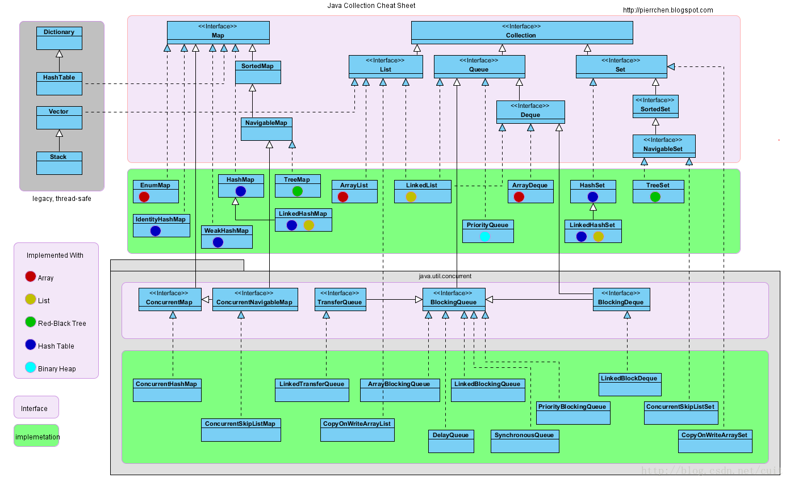

## LeetCode Theory

### Array  
|类型|英文名/类名|特点|有用链接|
|:---|:---  |:---|:---|
|[基础理论](Array.md)|Array || |
 
### String
|类型|英文名/类名|特点|有用链接|
|:---|:---  |:---|:---|
|[基础理论](String.md)|String || |
  
### Bitwise Operation
|类型|英文名/类名|特点|有用链接|
|:---|:---  |:---|:---|
|[基础理论](BitwiseOperation.md)|Bit || |
|[常见操作](BitwiseOperation.md)|Bitwise Operation || |

### DP
|类型|英文名/类名|特点|有用链接|
|:---|:---  |:---|:---|
|[DP基础](DP.md)|Dynamic Programming || |

### LinkedList
|类型|英文名/类名|特点|有用链接|
|:---|:---  |:---|:---|
|[链表基础](LinkedList.md)|LinkedList || |
|[链表反转](LinkedList-Reverse.md)|LinkedList Reverse || |
|[链表去重](LinkedList-DeleteDuplicate.md)|LinkedList DeleteDuplicate || |
|[链表找环](LinkedList-FindCircle.md)|LinkedList FindCircle || |
|[链表找交点](LinkedList-FindIntersection.md)|Find Intersection || |
|[链表合并](LinkedList-MergeTwoList.md)|Merge Two List || |

### SkipList
|类型|英文名/类名|特点|有用链接|
|:---|:---  |:---|:---|
|[基础理论](SkipList.md)|Skip List || |

### Stack
|类型|英文名/类名|特点|有用链接|
|:---|:---  |:---|:---|
|[基础理论](Stack.md)|Stack || |

### Queue
|类型|英文名/类名|特点|有用链接|
|:---|:---  |:---|:---|
|[基础理论](Queue.md)|Queue || |

### Hash
|类型|英文名/类名|特点|有用链接|
|:---|:---  |:---|:---|
|[哈希](HashTable.md) |Hash |快速查找 ||
|.NET哈希表 |Dictionary |泛型，HashTable非泛型 |[.NET官方源码](http://referencesource.microsoft.com/#mscorlib/system/collections/generic/dictionary.cs)|
|Java哈希表 |HashMap |链接长度大于8时改用红黑树 |[JAVA官方源码](http://grepcode.com/file/repository.grepcode.com/java/root/jdk/openjdk/8u40-b25/java/util/HashMap.java#HashMap) |
|[Java链式Hash表](https://docs.oracle.com/javase/7/docs/api/java/util/LinkedHashMap.html)|LinkedHashMap | | |
|去重Hash数据集 |HashSet |hash方式存储的去重key列表 |[.NET官方源码](https://github.com/dotnet/corefx/blob/master/src/System.Collections/src/System/Collections/Generic/HashSet.cs) |

---

### Tree
|类型|英文名/类名|特点|有用链接|
|:---|:---  |:---|:---|
|[二叉树](Tree-BinaryTree.md) |BinaryTree|| |
|[二叉树前序遍历](Tree-BinaryPreOrderTraversal.md) |BinaryTree PreOrder||中-左-右 |
|[二叉树中序遍历](Tree-BinaryInOrderTraversal.md) |BinaryTree InOrder|左-中-右| |
|[二叉树后序遍历](Tree-BinaryPostOrderTraversal.md) |BinaryTree PostOrder|左-右-中| |
|[二叉树层次遍历](Tree-BinarLeveOrderTraversal.md) |BinaryTree LevelOrder|| |
|[二叉树ZigZag遍历](Tree-BinaryTreeZigZagTraversal.md) |BinaryTree ZigZag Traversal|| |
|[判断二叉树对称](Tree-BinaryTreeIsSymmetry.md) |BinaryTree Is Symmetry|| |
|[判断二叉树相等](Tree-BinaryTreesAreSame.md.md) |BinaryTree Is Symmetry|| |
|[二叉树反转](Tree-BinaryTreeReverse.md) |BinaryTree Reverse|| |
|[二叉树最大高度](Tree-BinaryTreeMaxHeight.md) |BinaryTree MaxHeight|| |
|[二叉树最小高度](Tree-BinaryTreeMinHeight.md) |BinaryTree MinHeight|| |
|[二叉搜索树](Search-BST.md)|Binary Search Tree |有序的二叉树 | |
|[判断二叉搜索树](Tree-BinaryTreeIsBST.md)|Is Binary Search Tree?|有序的二叉树 | |
|[判断平衡二叉树](Tree-BinaryTreeIsBalanced.md)|Is Binary Search Tree Balanced? |有序的二叉树 | |
|[红黑树](Tree-RBTree.md) |Red Black Tree  |平衡的二叉搜索树 | |
|Java红黑树kv列表|TreeMap |Java实现  ||[JAVA官方源码](http://grepcode.com/file/repository.grepcode.com/java/root/jdk/openjdk/8u40-b25/java/util/TreeMap.java#TreeMap) |
|[.NET红黑树kv列表](https://docs.microsoft.com/en-us/dotnet/api/system.collections.generic.sorteddictionary-2?view=netframework-4.7.2) |SortedDictionary |.NET实现，内部用TreeSet存储 |[.NET官方源码](https://github.com/dotnet/corefx/blob/master/src/System.Collections/src/System/Collections/Generic/SortedDictionary.cs) |
|Java.红黑树k列表|TreeSet |红黑树方式存储的去重key列表 |[Java官方介绍](https://docs.oracle.com/javase/7/docs/api/java/util/TreeSet.html) |
|[.NET红黑树k列表](https://docs.microsoft.com/en-us/dotnet/api/system.collections.generic.sortedset-1?view=netframework-4.7.2) |SortedSet |红黑树方式存储的去重key列表|[.NET官方源码](https://github.com/dotnet/corefx/blob/master/src/System.Collections/src/System/Collections/Generic/SortedSet.cs) |
|~~[SortedList(kv)](https://docs.microsoft.com/en-us/dotnet/api/system.collections.sortedlist?view=netframework-4.7.2)~~|~~SortedList~~ |~~内部是两个数组,使用二分查找~~ |~~[.NET官方源码](https://github.com/dotnet/corefx/blob/master/src/System.Collections/src/System/Collections/Generic/SortedList.cs) ~~|

#### 注意：
  - SortSet 在Java中是接口，在.NET中是具体类
  - List在 Java中是接口，在.NET中是具体类
  - TreeSet 在Java中是具体类，在.NET中是内部类
  - HashMap 当取空key时，Java返回null
  - Dictionary 当取空key时，.NET抛异常
  - SortedList 的内部是数组实现，并非红黑树

---

### Trie
|类型|英文名/类名|特点|有用链接|
|:---|:---  |:---|:---|
|[字典树](Tree-Trie.md)|Trie || |

### UnionFind | Disjoint
|类型|英文名/类名|特点|有用链接|
|:---|:---  |:---|:---|
|[并查集](UnionFind.md)|UnionFind || |

### Graph

|类型|英文名/类名|特点|有用链接|
|:---|:---  |:---|:---|
|[图](Graph.md)|Graph ||[微软doc中关于图的介绍](https://docs.microsoft.com/en-us/previous-versions/ms379574(v=vs.80)) |
|图的表示-邻接列表|Adjacency List || |
|图的表示-邻接矩阵|Adjacency Matrix || |
|[无向图](Graph-Undirected.md)| Graph || |
|[有向图](Graph-Directed.md)| Graph || |
|[连通分量](Graph-ConnectedComponent.md)|ConnectedComponent || |
|[强连通图](Graph-StronglyConnected.md)|StronglyConnected || |
|无权重图|Unweighted Graph || |
|有权重图|Weighted Graph || |
|稀疏图|Sparse Graph || |
|稠密图|Dense Graph || |
|[最短路径](Graph-ShortestPath.md	)|Shortest Path || |
|[深度优先搜索](Graph-DFS.md)|Depth First Search || |
|[广度优先搜索](Graph-BFS.md)|Breadth First Search || |
|[迪杰克斯拉](Graph-Dijkstra.md)|Dijkstra || |
|[最小生成树](Graph-MinimumSpanningTree.md)|Minimum Spanning Tree || |
|[拓扑排序](Graph-Topology.md)|Topology || |

---

### Search
|类型|英文名/类名|特点|有用链接|
|:---|:---  |:---|:---|
|[查找](Search.md)|Search || |
|[二分查找](Search-BinarySearch.md)| Binary Search|| |

### Sort
|类型|英文名/类名|特点|有用链接|
|:---|:---  |:---|:---|
|[排序](Sort.md)|Sort || |
|[选择排序](Search-Selection.md)| Selection Sort|| |
|[插入排序](Sort-Insertion.md)|Insertion Sort || |
|[归并排序](Sort-Merge.md)| Merge Sort || |
|[快速排序](Sort-Quick.md)| Quick Sort || |
|[堆排序](Sort-Heap.md)| Heap Sort || |

### Java 数据结构关系图：

---
<!---
- #### Array

- ### String

- ### [LinkedList](LinkedList.md) 

- ### Queue

- ### Stack

- ### Heap

- ### Hash (HashSet HashMap)

- ### Tree (Binary Tree)
- ### Trie (Dictionary Tree)

- ### Graph
- ### Geometry
---
- ### Sort
---
- ### Recursion

- ### DFS
- ### BFS
- ### DP
  - Basic Theory
  - [Top 50 Dynamic Programming Practice Problems](https://medium.com/@codingfreak/top-50-dynamic-programming-practice-problems-4208fed71aa3)
  - [Top Coder DP introduction](https://www.topcoder.com/community/competitive-programming/tutorials/dynamic-programming-from-novice-to-advanced/)
- ### UnionFind
- ### Greedy
- ### Backtracking
- ### BitOperation
- ### Minimax
- ### DivideAndConquer
- ### Regex

- ### Math
- ### Shortest Path
---
- ### Cache

--->
